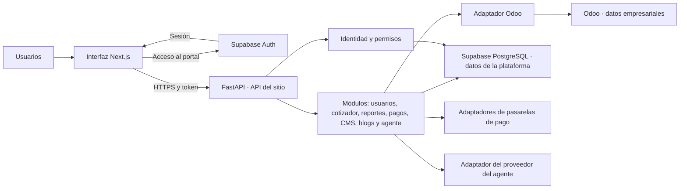

# Arquitectura propuesta — plataforma web Hercas

Estado: alcance funcional confirmado por el usuario: usuarios, cotizador, reportes
internos y para clientes, pasarelas de pago, CMS, blogs con redes sociales
automatizadas y agente de respuesta.
La estructura técnica, los límites y las etapas siguientes son una propuesta.
Confirmar módulos no significa que sus funciones ya estén implementadas ni que
deban lanzarse todos al mismo tiempo.

Ampliaciones confirmadas: publicaciones programadas en un circuito de pantallas
digitales de la ciudad; renderización de productos solicitados por clientes para
facilitar la cotización; planificación de disponibilidad dentro del cotizador.
Se propone ubicar pantallas como capacidad operativa propia y los renders dentro
del cotizador. Esa separación técnica aún es propuesta, no nuevos módulos aprobados.

Capacidad futura confirmada: el agente podrá incorporar al CRM de Odoo a los
interesados captados desde la web. Se planifica sin habilitar todavía escrituras.

Decisión comercial confirmada: Katherine lidera la disponibilidad y cada comercial
opera reservas y alquileres desde su cuenta en el website, con una vista conectada
al cotizador. El cliente final ve la misma disponibilidad y obtiene su reserva
cuando paga. Un administrador de precios del cotizador gestiona las tarifas por
producto. Los registros vigentes son la referencia para cotizar. Los accesos se
controlan mediante roles funcionales, sin codificar nombres personales.

## Objetivo y estructura

**Prioridades transversales confirmadas: seguridad, rendimiento y SEO.** Cada
módulo debe justificar su costo de carga y ejecución. Ampliar capacidades no debe
añadir automáticamente código, consultas o dependencias a todas las páginas.
La optimización conserva exactitud, autorización y accesibilidad.

Un backend FastAPI organizado como monolito modular: una base de código desplegable,
módulos de negocio separados, identidad común y adaptadores compartidos. Esta
estructura permite empezar con el cotizador sin convertirlo en el centro de toda
la plataforma ni crear servicios distribuidos antes de necesitarlos.
Los trabajos pesados se ejecutarán en procesos de trabajo separados de la API, con
concurrencia y recursos limitados, aunque compartan repositorio y reglas de negocio.

## Rendimiento y SEO como criterios de aceptación

La seguridad es un criterio equivalente de entrega. El [plan de seguridad](seguridad.md)
define controles contra ataques web, abuso automatizado y manipulación del agente,
con pruebas y distinción entre lo implementado y lo pendiente. Cumplir rendimiento
no permite exponer un módulo que falle autorización o aislamiento de clientes.

**Separación de experiencias.** La web pública (páginas, productos publicados y
blogs) entrega contenido renderizado e indexable con JavaScript mínimo. El portal
privado y el panel administrativo cargan sus herramientas solo en sus rutas. No
incluir editores CMS, gráficas, calendarios, SDK de pagos ni visores 3D en el layout
global público. Separación por rutas y paquetes primero; despliegues separados solo
si las mediciones o el aislamiento operativo lo justifican.

**Contenido público.** Pre-renderizar o cachear contenido editorial publicado cuando
sea adecuado y actualizarlo al publicar o modificar. Servir archivos públicos desde
almacenamiento/CDN; entregar HTML útil sin esperar consultas a Odoo por cada visita.
Una caída del ERP no debería impedir leer un artículo ya publicado. Acordar frescura
para precios y disponibilidad; al confirmar operaciones se verifican datos actuales.
Nunca compartir caché pública para sesiones, reportes ni datos de clientes.

**Carga por necesidad.** Cargar el agente al solicitarlo, no su motor ni historial
en la primera vista. Mostrar miniaturas optimizadas de renders y cargar visores
interactivos solo al abrirlos. Usar tamaños adaptados, dimensiones declaradas y
formatos adecuados para imágenes; diferir contenido fuera de pantalla sin retrasar
la imagen principal que determina LCP. Revisar fuentes, videos, scripts de terceros
y etiquetas de seguimiento antes de incorporarlos.

**Trabajo pesado fuera de la respuesta web.** Renders, exportaciones, sincronización,
generación asistida y distribución social/pantallas usan trabajos persistentes en
segundo plano. La API devuelve identidad/estado del trabajo; el navegador consulta
con frecuencia limitada o recibe eventos cuando sea necesario. No usar tareas en
memoria del servidor web como única garantía de ejecución. Aplicar límites para que
una campaña o un render no agote CPU, memoria, conexiones o capacidad de la API/BD.

**Acceso a datos.** Paginar, devolver campos necesarios, evitar consultas repetidas,
indexar según consultas reales y medir latencia. Reportes extensos y agregaciones
no se calculan en cada visita pública. No dividir el sistema en microservicios ni
añadir colas/proveedores diferentes por módulo sin una necesidad comprobada.

**SEO técnico.** Mantener títulos y descripciones, URLs estables, enlaces rastreables,
canónicas y sitemap de contenido público publicado. Al migrar URLs existentes,
preparar un mapa de redirecciones y comprobar estados HTTP. Datos estructurados
solo cuando correspondan al contenido visible. Las zonas privadas exigen autenticación;
noindex no reemplaza permisos. Evitar que borradores o combinaciones de filtros
generen páginas indexables duplicadas.

Objetivos de experiencia real para páginas públicas, al percentil 75 y separando
móvil/escritorio: **LCP ≤ 2,5 s, INP ≤ 200 ms y CLS ≤ 0,1**, conforme a los
[umbrales de Core Web Vitals](https://web.dev/articles/vitals).
Son objetivos por verificar, no resultados medidos en este proyecto.

Antes de implementar el frontend se medirá una línea base por tipo de página y se
fijarán presupuestos de JavaScript transferido, imágenes, solicitudes y latencia.
Las nuevas funciones deberán respetar esos presupuestos. Comprobar build de
producción y navegación móvil, comparar cambios en condiciones equivalentes y
corregir regresiones antes de publicar. Lighthouse sirve como diagnóstico de
laboratorio; completar con métricas de usuarios reales y Search Console cuando
existan tráfico y datos suficientes. No afirmar éxito de INP usando solo una prueba
de carga de página sin interacciones.

Medir también solicitudes fallidas, colas, latencia de FastAPI/Odoo y consultas de
BD para detectar si las operaciones internas afectan a los visitantes. La calidad
del contenido y su utilidad siguen siendo parte del trabajo SEO: buenos indicadores
técnicos por sí solos no garantizan posiciones en Google, como indica su
[documentación de experiencia de página](https://developers.google.com/search/docs/appearance/page-experience).

Estado actual: requisito y controles documentados; no se ha auditado ni optimizado
todavía el frontend del sitio. No se dispone de una línea base de ranking o rendimiento.

El navegador nunca recibe credenciales de Odoo. Las operaciones empresariales
pasan por FastAPI. Las pantallas públicas de contenido tendrán rutas
públicas específicas; no se expondrán endpoints internos para resolver ese caso.

## Los siete módulos

| Módulo | Responsabilidad propuesta | Relación con Odoo | Acceso |
| --- | --- | --- | --- |
| Usuarios | Perfiles, invitaciones, asociación a empresa/cliente, roles y permisos | Vincular un cliente web con su contacto/empresa Odoo mediante un mapeo verificado | Cada usuario a su perfil; administración según permiso |
| Cotizador | Selección, cálculo, borradores, aprobaciones, vista de disponibilidad y reserva/alquiler por cada comercial, coordinación de Katherine, tarifas por producto y renders | Catálogo/clientes de Odoo; disponibilidad y precios web con responsables propios; publicación de documentos por acordar | Cuenta individual para cada comercial; permisos separados para ventas, administración de disponibilidad y tarifas; clientes según función y propiedad |
| Reportes | Indicadores, consultas y exportaciones con alcance interno o por cliente | Leer información empresarial autorizada y combinarla con actividad de la plataforma | Personal según función; cada cliente solo su información |
| Pagos | Intenciones de pago, seguimiento, notificaciones del proveedor y conciliación | Relacionar el pago con el documento comercial/contable correspondiente | Clientes sobre documentos propios; personal financiero autorizado |
| CMS | Páginas, secciones, navegación, recursos y flujo de publicación | Referencias a productos cuando haga falta; contenido editorial propio de la web | Editores/admin; público solo contenido publicado |
| Blogs y redes sociales | Artículos, estrategia editorial, campañas, calendario, adaptación por canal, aprobación, programación, publicación y métricas | Referencias comerciales verificadas cuando una campaña las necesite | Autores, revisores, publicadores y analistas según permiso; público solo contenido publicado |
| Agente de respuesta | Conversación, consultas, derivación humana y captación de interesados para CRM | Consultas autorizadas y futura creación controlada de leads/oportunidades | Respuestas según identidad y permisos; captación bajo una política específica |

CMS y blogs comparten recursos y mecanismos editoriales, pero tienen contratos
propios: el CMS administra páginas; blogs administra artículos y el ciclo editorial
de redes sociales. Una campaña social puede existir sin un artículo asociado. Usuarios es un
módulo de gestión de personas y accesos; la validación de sesión permanece en el
núcleo compartido para no depender de un módulo de negocio.

Odoo alimenta los datos empresariales, no necesariamente todo el contenido de la
web. CMS, blogs, sesiones y conversaciones tienen necesidades propias de la
plataforma. No se necesita una base Supabase independiente para cada módulo.

### Circuito de pantallas digitales

El alcance incluye programar publicaciones en pantallas físicas de la ciudad.
Se propone una capacidad operativa **Pantallas y campañas**, separada de la
publicación social aunque reutilice recursos creativos del CMS/Blogs. No se crean
por ahora endpoints ni un octavo módulo hasta cerrar ese límite funcional.

Responsabilidades: identificar circuitos, ubicaciones, pantallas y reproductores;
definir campañas, piezas, fechas y horarios; validar formatos; programar distribución;
recibir estado de dispositivos y, si el sistema lo permite, evidencia de reproducción.
El envío exitoso de una pieza no demuestra que se haya reproducido.

Por ahora “programático” se interpreta como programación y distribución automatizadas.
Compra de medios mediante subastas, DSP/SSP o integraciones publicitarias externas
queda por aclarar; no se presupone incluida por ese término.

El cotizador determina qué capacidad comercial se ofrece y reserva. La operación
de pantallas convierte una reserva aprobada en una programación técnica. No debe
reservar inventario por su cuenta ni mantener una disponibilidad comercial paralela.

## Propiedad de los datos

Propuesta a validar con el funcionamiento real de Odoo:

| Datos | Sistema que los controla | Uso en la plataforma |
| --- | --- | --- |
| Identidad, contraseña y sesión web | Supabase Auth | Una cuenta por persona para todo el sitio |
| Perfil web, membresías y permisos | Supabase PostgreSQL | Autorizar acciones y módulos |
| Clientes, productos, unidades y categorías | Odoo | Lectura mediante adaptador; copias sincronizadas solo cuando hagan falta |
| Datos contables, fiscales y documentos ERP | Odoo | Referencias y estados necesarios para el módulo |
| Borradores, requisitos y actividad del cotizador | Supabase PostgreSQL | Estado propio del flujo web |
| Instantánea de una cotización | Supabase PostgreSQL | Conservar el precio y datos utilizados al emitirla |
| Precios por producto para cotizar en la web | Plataforma; rol de administrador de precios del cotizador | Usar la versión publicada vigente; referencias Odoo no reemplazan automáticamente estos precios |
| Descuentos excepcionales y aprobaciones comerciales | Reglas y responsables por confirmar | Conservar precedencia del piloto, sin asumir que todo descuento está autorizado |
| Datos maestros del activo físico | Origen por confirmar en Odoo/inventario existente | Separarlos de la disponibilidad operativa administrada en la web |
| Separaciones temporales web | Plataforma web, con calendario en Supabase | Deben reconciliarse con compromisos originados en Odoo si existen allí |
| Disponibilidad operativa del sitio | Plataforma web; calendario en Supabase mantenido por la encargada | Fuente de verdad en tiempo real para cotizador, website y agente, incluidas separaciones y reservas |
| Reservas comerciales y compromisos originados en Odoo | Calendario web como autoridad; incorporación y conciliación con Odoo por definir | No presentar disponible un recurso con compromisos vigentes; evitar autoridades paralelas |
| Circuitos, pantallas y relación con activos comerciales | Por confirmar entre Odoo, plataforma y sistema de pantallas | Mantener identificadores vinculados sin duplicar activos físicos |
| Horarios, listas de reproducción y entregas a pantallas | Propuesta: capacidad operativa de pantallas | Ejecutar campañas sobre capacidad comercial autorizada |
| Estado del dispositivo y evidencia de reproducción | Sistema de reproducción/dispositivo | Guardar observaciones con fecha y origen; no confundir programación con ejecución |
| Solicitudes, versiones y aprobación de renders | Plataforma | Vincular a cliente, producto y versión de cotización; conservar recursos privados |
| Cotización/pedido definitivo en Odoo | Por definir según el proceso comercial | Publicar solo en el evento de negocio acordado |
| Estado de una transacción de pago | Proveedor de pago, verificado por el backend | Registrar eventos, conciliación y relación con documentos Odoo |
| Asientos, facturas y aplicación contable del pago | Odoo | Sincronizar con confirmación y trazabilidad, sin duplicar contabilidad |
| Páginas, artículos, navegación y metadatos editoriales | Propuesta: plataforma | Borradores, versiones y publicación; confirmar si se migra contenido existente |
| Campañas, calendario, versiones por canal y autorizaciones de publicación | Plataforma | Plan editorial y trazabilidad del contenido aprobado |
| Publicaciones sociales efectivas y métricas del canal | Cada red social | Guardar identificadores externos, resultados y métricas con fecha de consulta |
| Definiciones y exportaciones de reportes | Plataforma | Los valores derivan de datos autorizados de Odoo/plataforma; indicar fecha de actualización |
| Conversaciones y configuración del agente | Propuesta: plataforma | Historial con acceso y retención definidos; fuentes autorizadas para cada usuario |

Que un módulo use datos de Odoo no significa que todas sus tablas deban vivir allí.
Tampoco implica copiar toda la base del ERP en Supabase. Cualquier réplica es de
lectura y conserva referencia al registro original; las modificaciones del dato
maestro se realizan en su sistema propietario.

## Integración con Odoo

Un adaptador compartido encapsula autenticación, llamadas, límites, errores y
transformación de datos. Los módulos usan operaciones concretas como buscar
clientes o consultar productos; no reciben un acceso genérico sin restricciones
a modelos/métodos del ERP.

Primera etapa: consultas de lectura y comprobación de modelos, campos y permisos
contra la instalación existente. La elección de consultas directas o sincronización
se hará por recurso según volumen, latencia y frecuencia de cambio medidos.

Si se necesita réplica, guardar identificación del sistema de origen, modelo e ID
Odoo, fecha de modificación del origen y última sincronización. Una caída de Odoo
debe distinguirse de un catálogo vacío. Los datos almacenados en caché deben informar
su antigüedad; la aceptación de una cotización con datos antiguos requiere una regla
de negocio, no una decisión automática de infraestructura.

Las escrituras futuras tendrán identificador de operación para evitar duplicados,
estado de sincronización y reintentos controlados. No reintentar una creación a
ciegas. Una transacción PostgreSQL no incluye Odoo: si el flujo requiere ambos,
registrar la operación pendiente de envío en la misma transacción local y procesarla
después, con trazabilidad del resultado.

## Usuarios y autorización

Decisiones confirmadas: acceso por invitación, varios usuarios por empresa cliente
y una sola compañía operadora (Hercas). El correo inicial proporcionado es
`sitemas@hercas.net`, literalmente. Hay una migración local de identidad, membresías,
permisos e invitaciones con pruebas PostgreSQL, aplicada en `hercas-platform-dev`
el 17 de septiembre de 2026. Ver [base de identidad](../supabase/README.md).

- Autenticación global con Supabase Auth. No guardar contraseñas propias ni
  duplicar cuentas por módulo.
- Perfil activo y acceso a módulos son condiciones distintas. Una cuenta sin
  permisos comerciales puede tener sesión y no puede operar el cotizador.
- Diseñar permisos por acción: cotizador.leer, cotizador.crear,
  cotizador.tarifas.administrar, cotizador.reservas.gestionar. Son nombres propuestos,
  no permisos ya implementados.
- Los roles agrupan permisos. Mantener autorización en datos controlados por el
  servidor; nunca confiar en roles enviados por el navegador o user_metadata.
- Los reportes para clientes requieren acceso externo. Vincular usuarios con una
  cuenta cliente/empresa y su identificador Odoo mediante invitación o validación
  administrativa; nunca por coincidencia de nombre o correo solamente. Un usuario
  no puede asignarse por sí mismo un customer_id para ver información ajena.
- Separar la organización operadora (Hercas) de las empresas cliente. La pertenencia
  a una empresa cliente limita filas, documentos, reportes y pagos. Si Hercas opera
  varias compañías Odoo, definir además ese alcance. El piloto basado solo en
  creador de cotización no cubre aún estos casos.
- Aplicar controles en FastAPI y RLS en PostgreSQL. Las vistas del frontend no son
  una barrera de autorización.

Actualmente la API utiliza los códigos de rol compatibles con el piloto y el JWT
del usuario para consultar Supabase. La nueva base añade roles de cliente ligados
a empresas y aceptación de invitaciones. Las tablas ya están aplicadas en desarrollo;
la configuración remota de Auth y el portal externo siguen pendientes.

## Módulos y capas

La [auditoría de catálogo del 17/09/2026](catalogo-auditoria-2026-09-17.md) identifica
206 referencias, incluyendo dos registros internos. La base de precios simples no
sustituye el modelo pendiente de atributos, formularios y reglas para fabricación.
Conservar referencias Odoo y separar productos configurables, activos y paquetes.

Cada módulo tendrá rutas, contratos de entrada/salida, reglas de negocio y
servicios de aplicación según lo necesite. El dominio no depende de HTTP ni de
Odoo. Los adaptadores traducen los datos externos al contrato del módulo.

Identidad, configuración, errores e integraciones son compartidos. Catálogo,
clientes e inventario son actualmente consultas del cotizador; si otro módulo
necesita esas capacidades, se extraerán servicios compartidos con límites claros.
El alcance incluye siete módulos; no se crearán endpoints vacíos ni se presentarán
carpetas como funcionalidades terminadas.

Rutas actuales: `/api/v1/auth/*`, `/api/v1/cotizador/*` e
`/api/v1/integraciones/odoo/*`. Las rutas anteriores sin prefijo de módulo se
retiraron en la reorganización inicial. Los módulos futuros usarán su propio prefijo.

Prefijos propuestos para el resto: `/api/v1/usuarios`, `/api/v1/reportes`,
`/api/v1/pagos`, `/api/v1/cms`, `/api/v1/blogs` y `/api/v1/agente`.
Son contratos de organización previstos, todavía no rutas operativas.

## Flujos y límites entre módulos

### Disponibilidad dentro del cotizador

**Operación comercial confirmada.** Katherine lidera la disponibilidad. Cada
comercial tiene una cuenta en el website y una vista de disponibilidad conectada
al cotizador. Desde allí registra el alquiler o reserva de una valla para el
periodo que acuerde con el cliente, indicando fecha de inicio y fecha de fin;
también puede iniciar su liberación. Katherine coordina la operación, pero no es
la única que registra cambios. La gestión de recursos y bloqueos requiere
permisos separados de precios. Registrar actor, momento, motivo y versión de
cada cambio, con controles ante ediciones simultáneas. Falta definir si un
comercial puede liberar reservas ajenas y cuándo una separación se convierte en
alquiler confirmado.

El cliente final y el comercial consultan el mismo calendario del website. El
comercial decide si reserva durante su gestión de venta; para el cliente final,
la reserva se confirma al pagar. Tras verificar el pago, la creación o conversión
de la reserva debe comprobar y ocupar capacidad en una transacción. Si el pago
termina después de que otro actor ocupó el periodo, hace falta una política
explícita de separación durante el pago y de fallo o reversión; no se presume
una reserva del cliente por la sola consulta o inicio del pago.

**Qué significa “en vivo”.** El cotizador, la web y el agente consultan la misma
fuente operativa en el servidor. Reflejar cambios en las vistas abiertas mediante
notificaciones o actualización acotada; definir el objetivo de latencia y mecanismo
al implementar. Mostrar última actualización y estado de conexión. Si se pierde
conexión, indicar datos desactualizados y no confirmar disponibilidad desde caché.
La actualización automática de pantalla no reemplaza la comprobación transaccional.
Por decisión del usuario del 30/09/2026, la plataforma web es la autoridad de
disponibilidad: Supabase conserva el calendario operativo y el website es su
interfaz en tiempo real. Una confirmación debe escribirse allí de forma atómica.
Odoo recibe o aporta compromisos mediante conciliación, sin decidir por separado
si una valla se ofrece como disponible.

No crear un booleano “disponible” que ignore contratos o reservas. La disponibilidad
efectiva combina el calendario mantenido por la encargada, bloqueos operativos y
capacidad ya separada/reservada para el intervalo solicitado. Un cambio manual no
puede liberar una reserva vigente silenciosamente; cancelación o corrección requiere
un flujo explícito, motivo y trazabilidad. Compromisos externos deben incorporarse
conforme al proceso de conciliación acordado.

La planificación de disponibilidad forma parte del cotizador. Debe permitir
consultar por producto/activo, fechas y, cuando aplique, franja horaria y capacidad;
mostrar bloqueos, separaciones con vencimiento, reservas y mantenimiento; proponer
alternativas y volver a validar al confirmar.

Modelar la modalidad de cada producto: un activo exclusivo puede admitir solo una
reserva por intervalo; una pantalla compartida puede vender franjas, segundos por
ciclo o una cuota de reproducción. Estos últimos modelos son opciones por definir,
no reglas comerciales asumidas. Una pantalla no debe representarse únicamente
como “libre/ocupada” si se comercializa capacidad parcial.

Una consulta disponible no constituye una reserva. La confirmación debe verificar
y descontar capacidad de forma atómica, impedir cruces o sobreventa y liberar
capacidad conforme a la cancelación o expiración. El vencimiento de 72 horas existe
en el piloto; confirmar su aplicabilidad a cada familia antes de generalizarlo.

Usar fechas civiles para las reglas que lo requieran y zona horaria explícita para
franjas/horarios. El dominio piloto trata los extremos de fechas como inclusivos;
la convención de intervalos horarios debe definirse explícitamente, para permitir
o impedir franjas contiguas sin ambigüedad. Probar concurrencia, capacidad parcial,
reprogramación, mantenimiento y dos clientes intentando reservar lo mismo.

Si Odoo también puede generar ocupación, definir cómo se incorpora al calendario
web antes de vender: un bloqueo en Supabase no impide por sí solo que un usuario
del ERP registre el mismo activo. La planificación comercial debe conciliar esos
compromisos conforme a una política explícita de frescura y resolución de conflictos.

### Administrador de precios del cotizador

El administrador de precios del cotizador gestionará las tarifas por producto. Es un rol asignable a usuarios autorizados, propuesto
como `pricing_manager` del piloto. Asociar la tarifa al producto e incluir importe,
moneda, unidad comercial, vigencia, estado y versión. Una tarifa semanal, mensual,
por unidad o por franja debe conservar esa unidad; no asumir equivalencias.

Propuesta de flujo: editar borrador → validar → publicar. Solo las tarifas publicadas
y vigentes se utilizan para nuevas cotizaciones; referencias, valores pendientes o
suspendidos no se ofrecen como precios oficiales. Mantener las reglas del piloto
sobre continuidad de la última versión publicada mientras se revisa la siguiente.

Conservar historial, autor y fecha. La sincronización de catálogo Odoo no sobrescribe
precios administrados en la web. Confirmar después si deben enviarse también a Odoo
y a qué estructura comercial, evitando crear dos fuentes independientes.

El backend calcula desde esas tarifas y acuerdos autorizados, no desde precios
enviados por el navegador o el agente. Al confirmar, verifica versión de precio y
disponibilidad. Si cambió el precio mostrado, devolver el cambio para revisión según
la política comercial; no modificar silenciosamente una cotización ya emitida.
Las cotizaciones conservan su instantánea y las condiciones de vigencia acordadas.

La gestión de descuentos excepcionales, la delegación del rol de precios y la vigencia de
una oferta emitida siguen por definir. El acceso se asigna a cuentas con permisos,
sin depender de nombres personales ni permitir autoasignación de rol.

**Pruebas de aceptación:** encargada sin permiso de tarifas y viceversa; tarifa
pendiente/suspendida no cotizable; cambio visible entre sesiones; conflicto entre
ediciones; desconexión; dos reservas simultáneas; cambio de precio antes de confirmar;
cotización emitida conservada. El agente consulta esta fuente y no inventa existencias
ni precios ante datos ausentes. La base SQL de tarifas, cotizaciones y calendario
exclusivo diario está aplicada en desarrollo; ver [alcance actual](../supabase/COTIZADOR.md).
Los paneles, workflows completos, capacidad compartida y notificaciones siguen pendientes.

### Renders de productos solicitados por clientes

El cliente o un usuario autorizado solicita un render desde el contexto de una
cotización: producto, dimensiones/requisitos, ubicación cuando aplique, referencias,
archivos de marca y observaciones. Guardar la solicitud aunque aún no esté decidido
el método de generación. “Render” puede significar montaje visual, imagen generada
o render 3D; tecnología, precisión, tiempos y costos se determinarán según el caso.

Flujo propuesto: solicitado → validado → en cola → en proceso → en revisión →
aprobado, con estados de fallo/cancelación. Cada resultado conserva versión, recursos
de entrada y vínculo a la versión de cotización. Distinguir aprobación visual del
cliente y aprobación comercial; ninguna sustituye a la otra.

La generación se ejecuta fuera de la petición HTTP y conserva trazabilidad y límites
de consumo por usuario/proyecto. Archivos y resultados son privados para el cliente
y el personal autorizado. Se pueden reutilizar recursos aprobados en campañas
solo cuando exista permiso; no publicar automáticamente un render de cliente.

Un render conceptual facilita la decisión, pero no cambia precio, dimensiones
técnicas ni disponibilidad por sí solo. Si el cliente cambia el producto o alcance,
crear una revisión, recalcular y revalidar disponibilidad antes de confirmar. No
reservar inventario por el solo hecho de solicitar o generar una imagen.

### Ejecución en pantallas

Flujo propuesto: seleccionar circuito/periodo → consultar capacidad en el cotizador
→ preparar cotización y render si se solicita → aprobar y reservar conforme al
proceso comercial → aprobar pieza técnica → programar y distribuir → registrar
reproducción disponible → reportar al cliente. El momento de exigir pago antes de
programar sigue pendiente de definición.

Los adaptadores se conectarán al software/reproductores existentes, sin asumir
que las pantallas aceptan archivos por una API determinada. Las piezas deben cumplir
orientación, resolución, duración y formato exigidos por ese sistema. Registrar
versiones de programación y confirmaciones de recepción cuando estén disponibles.

Prever dispositivo desconectado, distribución parcial, pieza inválida, mantenimiento,
cancelación y reprogramación. Definir qué debe reproducirse sin conexión, cómo se
retira una campaña vencida y qué evidencia se obtiene al reconectar según las
capacidades reales del reproductor. No prometer publicación o retirada inmediata
en un dispositivo sin conexión.

Reportes distingue lo contratado, reservado, programado, distribuido y efectivamente
reproducido. No inferir impresiones, audiencia ni reproducciones a partir de un mero
horario; esas métricas necesitan una fuente y una definición verificables.

**Cotización y pago.** El cotizador produce una versión identificable con importes
y moneda. Una intención de pago se crea desde un documento autorizado e inmutable,
no desde un total enviado por el navegador. Pagos conserva la referencia a esa
versión y al proveedor. Que el usuario vuelva a una página de éxito no prueba el
pago: el backend verifica la notificación o consulta el estado al proveedor.

Las notificaciones se autentican según la pasarela elegida, se procesan sin repetir
efectos y se registran para soportar duplicados o llegada fuera de orden. El estado
de pago y el estado de registro en Odoo se mantienen separados: un fallo del ERP no
debe hacer desaparecer un pago confirmado. El detalle de reembolsos, pagos parciales
y contracargos se definirá con el proveedor y el proceso comercial. Se propone un
checkout alojado/tokenizado; no almacenar datos de tarjeta en esta aplicación.

**Reportes internos y de clientes.** Comparten capacidades de consulta, pero tienen
proyecciones diferentes. El servidor obtiene el alcance del usuario y lo aplica
antes de consultar, agregar o exportar. Nunca generar un reporte global para luego
ocultar filas en la interfaz. Cada exportación conserva propietario, alcance y fecha
de los datos; su descarga vuelve a exigir permiso. Los archivos privados no usan
enlaces públicos permanentes. Las métricas se definirán antes de crear cada reporte.

**CMS y blogs.** Separar lectura pública de edición. Los borradores y vistas previas
requieren autorización; la publicación requiere un permiso explícito. Registrar
autor, versión y estado editorial. Un contenido enlazado a un producto Odoo no
convierte al CMS en responsable de modificar su precio o existencia.

### Blogs y redes sociales automatizadas

Decisión de alcance: la planificación y automatización de redes sociales pertenecen
al módulo Blogs, no a un octavo módulo. Dentro de él se separan las capacidades de
artículos, campañas, calendario, canales, publicaciones y analítica. Se mantiene
`/api/v1/blogs` como prefijo previsto, con recursos propios para esas capacidades.

**Plan editorial.** Definir objetivos, audiencia, temas, tono de marca, campañas,
frecuencia y calendario por cuenta/canal. Vincular artículos, productos o campañas
cuando corresponda, permitiendo también publicaciones sociales independientes.
Los canales y la frecuencia real están por acordar; no se presupone acceso a todas
las redes ni soporte de todos sus formatos.

**Preparación de contenido.** Crear un contenido base y variantes específicas de
texto, imágenes, video, enlaces y llamadas a la acción por canal. Compartir la
biblioteca de recursos con CMS y blogs. La generación asistida puede proponer
borradores; precios, promociones y disponibilidad deben venir de fuentes vigentes
y autorizadas. Validar formatos y capacidades contra la API oficial de cada red
cuando se seleccione su integración.

**Aprobación y automatización.** Flujo propuesto por variante: borrador → en revisión
→ aprobado → programado → en publicación → publicado, con estados de fallo y
cancelación. Vincular la aprobación a una versión concreta; un cambio de texto,
recurso, enlace o cuenta destino exige una nueva aprobación. Separar permisos de
crear, aprobar, programar, publicar y conectar cuentas. Automatizar la ejecución
de contenido aprobado; una futura política de publicación sin revisión necesitará
alcance, límites y autorización explícitos.

**Programación y publicación.** Guardar zona horaria editorial y fecha de ejecución
en UTC. Un proceso en segundo plano toma trabajos vencidos con bloqueo para evitar
ejecuciones simultáneas. Antes de publicar comprueba versión aprobada, cuenta activa,
permisos, cancelación y recursos. Cada cuenta/canal tiene una entrega independiente:
el fallo de una red no provoca republicar en las otras.

Usar una identidad estable para cada entrega y el mecanismo de idempotencia que
soporte el proveedor. Si la respuesta se pierde después de enviar, comprobar el
resultado remoto cuando sea posible; si queda ambiguo, solicitar revisión en lugar
de crear duplicados. Los reintentos se limitan según tipo de error y restricciones
del proveedor. Cancelar una programación ya enviada no garantiza eliminar un post:
registrar ese resultado y gestionar edición o retirada como acciones explícitas.

**Conexión de cuentas.** Adaptadores por red, con autorización oficial, permisos
mínimos y credenciales guardadas de forma protegida en el servidor. Registrar
revocación/vencimiento, desconexión y errores que requieren intervención. No usar
contraseñas compartidas ni automatización de la interfaz como base de publicación.
Los requisitos de revisión de aplicaciones, costos, límites y permisos se verificarán
al elegir cada canal. No hay integraciones sociales implementadas todavía.

**Métricas.** Guardar ID y URL externos, fecha efectiva, estado, errores e historial
de entrega. Recoger métricas disponibles con fecha de observación y enlaces de
campaña identificables. Distinguir ausencia de datos de cero resultados y no asumir
que métricas de distintas redes son equivalentes. Blogs controla estas entidades;
Reportes consume sus datos autorizados para paneles y exportaciones.

**Alcance inicial propuesto.** Cuentas propias de Hercas, publicación y métricas.
Confirmar si también se administrarán cuentas de clientes. Comentarios, mensajes
privados, anuncios pagados y gasto publicitario no quedan habilitados por esta
decisión; requieren definir alcance y permisos propios. Si se incluye atención
social, el módulo Agente podrá redactar respuestas a través de los adaptadores,
sin obtener por ello autorización para publicar o responder automáticamente.

**Entrega por etapas.** Primero calendario, borradores, recursos y aprobación;
después integrar un canal elegido y verificar publicación programada, revocación,
cancelación, reintentos y protección contra duplicados; luego métricas y más
canales. Verificar aislamiento entre cuentas y que un borrador o una versión
modificada nunca se publique con una aprobación anterior.

**Agente de respuesta.** Empezar como asistente de consulta: contenido publicado
para visitantes y datos propios para clientes autenticados. Utiliza servicios del
backend con el alcance del usuario, sin credenciales generales de Odoo ni acceso SQL
libre. Documentos y conversaciones son datos, no instrucciones que puedan cambiar
permisos. Las fuentes de búsqueda privadas también se filtran por usuario/empresa.

Cotizar, reservar, publicar o iniciar un cobro desde el agente serán capacidades
adicionales sujetas a los mismos permisos y validaciones de cada módulo. No se
habilitan por el solo hecho de incorporar un modelo. Definir canal, historial,
retención, escalamiento humano y confirmaciones antes de darle acciones de escritura.

## Capacidades comunes necesarias

### Captación web hacia el CRM de Odoo

Capacidad futura solicitada: convertir el interés expresado en el sitio en un
registro comercial atendible en Odoo. Crear lead u oportunidad según el proceso
y configuración reales del CRM; no asumir que captar un interesado implica crear
automáticamente un cliente, contacto nuevo o cuenta web.

Flujo propuesto: interés por formulario/chat/cotización → recogida de datos de
contacto → validación en FastAPI → solicitud persistida → creación o vinculación
controlada en Odoo → confirmación y seguimiento comercial.

Recoger nombre, empresa si corresponde, correo/teléfono aportados, interés y un
resumen comercial; conservar origen, campaña y cotización asociada cuando existan.
No inventar campos ni copiar conversaciones completas o adjuntos privados por defecto.
Mostrar el uso previsto de los datos y registrar la solicitud de contacto y la
autorización correspondiente al flujo acordado. La suscripción a campañas posteriores
se trata separadamente. Definir retención y campos obligatorios antes de implementar.

Una herramienta específica, con campos permitidos y cuenta técnica limitada,
reemplaza el acceso genérico a modelos/métodos Odoo. El backend determina destino y
equipo comercial conforme a configuración, no a instrucciones libres del modelo.
La recepción pública puede admitir visitantes sin cuenta con límites y medidas
antiabuso, pero no les concede permisos de consulta o edición sobre el CRM.

Guardar una identidad estable por solicitud y el ID Odoo confirmado para evitar
duplicados por reenvíos o reintentos. Buscar coincidencias según reglas explícitas:
un correo/teléfono aportado no prueba identidad ni autoriza modificar un contacto
existente. Las coincidencias ambiguas se revisan sin revelar datos al visitante.

Si Odoo no responde, conservar la solicitud pendiente y reconciliar antes de
reintentar una creación cuyo resultado sea incierto. Informar “registrado en CRM”
solo después de confirmación real; recepción local no equivale a sincronización.
La operación se procesa fuera de la carga inicial del sitio para preservar rendimiento.

Probar alta válida, campos incompletos, abuso, duplicado, contacto ambiguo, caída de
Odoo y timeout tras creación. Verificar que no se puedan inyectar campos de privilegio,
modificar etapas/asignaciones ni consultar clientes mediante esta herramienta.

Estado: planificado, sin herramienta CRM operativa ni registros creados. Antes de
implementar, inspeccionar campos, permisos y proceso del Odoo conectado.

### Servicios transversales

- Auditoría: actor, módulo, acción, recurso, resultado y correlación con Odoo o
  pasarelas, evitando registrar contraseñas, tokens o contenido privado innecesario.
- Trabajos en segundo plano para sincronización, exportaciones y procesamiento de
  eventos, incluida la programación social, distribución a pantallas y generación
  de renders. Definir mecanismo y
  despliegue cuando se dimensione el volumen; no se
  necesita elegir ahora un proveedor de colas.
- Archivos con propietario, clasificación pública/privada y permisos de descarga.
- Configuración por entorno y secretos de integraciones solo del lado servidor.
- Contratos de integración e idempotencia comunes, con adaptadores separados para
  Odoo, pasarelas, redes sociales, sistema de pantallas, renderización y proveedor
  del agente. Un proveedor puede cubrir más de una integración, sin mezclar permisos.

## Mapa lógico de datos propuesto

Sin SQL definitivo todavía:

- Identidad: perfiles, cuentas cliente, membresías y asignaciones de permisos.
- Integración: referencias Odoo, marcas de sincronización y operaciones pendientes.
- Captación CRM: solicitudes, origen, autorización del contacto, estado de
  sincronización, identidad de operación y vínculo al lead/oportunidad Odoo.
- Cotizador: cotizaciones, versiones, líneas, aprobaciones, recursos/capacidades,
  reglas de calendario, bloqueos, separaciones y reservas; solicitudes de render,
  trabajos, versiones de resultado y revisiones/aprobaciones.
- Pantallas (capacidad propuesta): circuitos, dispositivos y referencias a activos,
  campañas, piezas técnicas, programaciones versionadas, entregas y evidencia de
  reproducción cuando exista. Reservas comerciales pertenecen al cotizador.
- Reportes: definiciones autorizadas y ejecuciones/exportaciones.
- Pagos: intenciones, eventos del proveedor, operaciones y conciliaciones.
- Editorial: recursos compartidos; páginas/versiones CMS; artículos y taxonomías blogs;
  campañas, cuentas sociales, variantes versionadas, aprobaciones, programaciones,
  entregas por canal, intentos de publicación y observaciones de métricas.
- Agente: conversaciones, mensajes y referencias a fuentes según alcance.

Los permisos y la propiedad se diseñan antes de las tablas. Se reutilizará lo útil
del esquema piloto, sin asumir que su modelo de usuarios cubre la plataforma completa.

## Plan y criterios para avanzar

1. **Cerrar procesos y autoridad de datos.** Los siete módulos ya están identificados.
   Definir su alcance mínimo, permisos externos, reglas de tarifas/disponibilidad y momento de
   creación de documentos en Odoo. Resultado: decisiones explícitas en este documento.
2. **Preparar la plataforma.** Proyecto Supabase de desarrollo, configuración,
   perfiles, permisos y migraciones revisadas. Probar sesión, revocación y acceso
   denegado entre usuarios y módulos. La estructura de carpetas ya está separada.
3. **Verificar la integración de lectura.** Mapear clientes/productos reales de Odoo,
   unidades e IDs, manejar indisponibilidad y definir la política de sincronización.
4. **Completar el cotizador.** Crear vista de disponibilidad y reserva para cada
   comercial, coordinación de Katherine y panel
   de tarifas por producto para el administrador de precios del cotizador, con permisos separados. Resolver tarifas publicadas,
   persistir instantáneas y guardar cotizaciones en transacciones. Incorporar
   planificación de disponibilidad, reservas con control concurrente y vencimiento,
   y solicitudes/versiones de renders. Primero verificar una modalidad comercial
   concreta y un tipo de render; ampliar a los demás con reglas explícitas.
5. **Portal y reportes iniciales.** Conectar Next.js con sesión global y navegación
   por permisos. Elegir un reporte interno y otro de cliente; probar aislamiento
   entre dos empresas cliente, tanto en consulta como en exportación.
6. **Pagos.** Seleccionar pasarela y proceso comercial; probar en su entorno de
   pruebas cobro, notificaciones duplicadas, fallos y conciliación con Odoo. Acordar
   qué evento cambia el estado comercial antes de aceptar pagos reales.
7. **CMS, blogs y redes sociales.** Implementar edición/publicación y lectura pública,
   compartiendo archivos y controles editoriales. Dentro de Blogs: calendario,
   campañas, variantes por canal, aprobación y publicación automática programada.
   Empezar con una red elegida, validar fallos y duplicados, agregar métricas y
   extender a otros canales. Esta etapa puede adelantarse después de la
   base de usuarios si el lanzamiento del sitio necesita contenido primero.
8. **Agente.** Conectar fuentes y servicios ya verificados. Probar respuestas con
   fuentes, aislamiento de datos, ausencia de autorización y derivación humana.
   Empezar con consultas; incorporar después captación controlada al CRM de Odoo,
   con validación, prevención de duplicados y seguimiento de sincronización.
   Añadir otras acciones solo cuando sus flujos estén definidos.
9. **Puesta en producción.** Entorno separado, auditoría, recuperación, monitoreo y
   pruebas de los flujos completos, incluidas fallas de Odoo y de proveedores.
   Verificar presupuesto de rendimiento, indexabilidad y redirecciones antes del
   lanzamiento; controlar métricas reales y errores después. Estos controles se
   aplican también en cada etapa anterior, no solo al final.

**Línea de implementación de pantallas:** levantar primero el circuito y el software
existente; acordar la unidad comercial y conectar el control de capacidad del
cotizador; realizar un piloto en una pantalla autorizada; validar programación,
cancelación, desconexión y evidencia; extender al circuito. Esta línea depende de
disponibilidad y recursos aprobados, no de terminar todas las integraciones sociales.

Las pruebas locales del motor no sustituyen las pruebas de RLS, concurrencia y
equivalencia con Odoo. El guardado y las reservas no están completos actualmente.

## Preguntas por resolver

1. ¿Qué reportes necesitan los empleados y cuáles los clientes en el primer corte?
2. ¿Los clientes también cotizarán y pagarán, o inicialmente solo verán reportes?
3. ¿Qué compromisos de inventario/reservas se originan en Odoo y cómo se incorporarán al calendario de la encargada? ¿Los precios publicados por el administrador de precios del cotizador deben sincronizarse hacia Odoo?
4. ¿Al guardar, enviar o aceptar una cotización debe crearse un documento en Odoo?
5. ¿Qué pasarela, país, monedas y modalidades de cobro deben soportarse?
6. ¿CMS/blogs reemplazarán contenido existente y quién podrá publicarlo?
7. ¿El agente atenderá en el sitio, WhatsApp u otros canales, y qué consultas resolverá?
8. ¿Habrá varias compañías operadoras Odoo o solo Hercas, además de sus empresas cliente?
9. ¿Qué redes y cuentas se conectarán primero: propias de Hercas o también de clientes?
10. ¿Quién aprueba contenido social y qué frecuencia, formatos y objetivos tendrá el calendario?
11. ¿Qué software/reproductor administra hoy las pantallas y cuántas pantallas/circuitos hay?
12. ¿Se vende una pantalla completa, franjas horarias, segundos por ciclo u otra unidad?
13. ¿Publicación programática significa programación automática o también compra publicitaria mediante plataformas externas?
14. ¿Los renders serán montajes sobre fotografías, imágenes conceptuales, modelos 3D o varios tipos?
15. ¿Qué evento autoriza reservar, programar y reproducir una campaña: aprobación, contrato o pago?
16. ¿El CRM usa leads, oportunidades directas o ambos, y qué equipo recibe los interesados web?
17. ¿Qué datos y validación de contacto se requieren antes de crear el registro CRM?
18. ¿Quién asigna o delega los roles de disponibilidad y administración de precios, y quién puede autorizar descuentos excepcionales o cancelar reservas?

Estas decisiones gobiernan las próximas migraciones; no crear tablas definitivas
ni sincronizaciones de escritura basadas en supuestos todavía abiertos.
